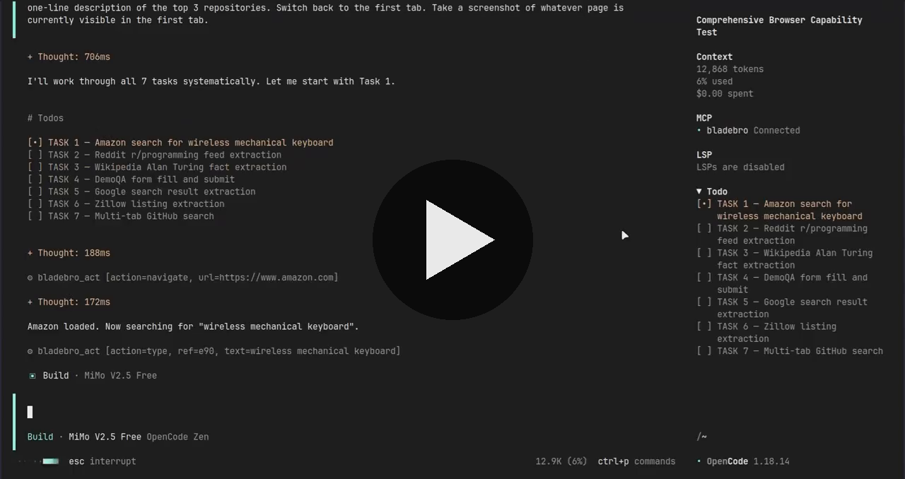

<div align="center">


**Give your AI agent a browser. Few tools. Full control. Real stealth. Zero runtime deps.**

Re-render-immune refs · batch actions · auto-extract · self-improving · 6-layer stealth

One MCP server · one persistent page model · zero Node.js · one binary · Linux · macOS · Windows

[](https://www.npmjs.com/package/bladebro)
[](https://www.rust-lang.org)
[](LICENSE)
[](https://github.com/dondai44423/bladebro/releases)
[](https://github.com/dondai44423/bladebro/actions/workflows/ci.yml)
[](https://www.npmjs.com/package/bladebro)
[](https://github.com/dondai44423/bladebro)
[](https://ko-fi.com/G5Y624N5RE)

```bash
npm install -g bladebro && bladebro mcp
```

[Install](#-install) · [The 5 tools](#-the-5-tools) · [Architecture](#-architecture) · [Re-render immunity](#-re-render-immunity) · [Self-improvement](#-self-improvement) · [Stealth](#-stealth-system) · [Comparison](#-comparison) · [Gotchas](#-gotchas) · [Limits](#-honest-limits)

</div>

---

Bladebro is an **agentic browser driver** built from the agent's perspective. Instead of 20+ tools that each do one thing, Bladebro gives you **5 tools** that together provide full control. It drives stock Chromium over CDP, holds a persistent **Live Page Model** across tool calls, and returns **diff-first** results: the agent sees what *changed*, not the whole world, every single time.

<p align="center">
  <a href="https://files.catbox.moe/44hv2w.mp4">
    
  </a>
</p>

<p align="center"><sub>Bladebro drives Amazon, Reddit, Wikipedia, fills a form, and manages tabs — all through 5 tools. Click to play.</sub></p>

Built in **Rust**. One static binary. No runtime. No Node.js. No Playwright shim. Just the browser engine and your agent. Native on Linux, macOS, and Windows.

Speaks MCP **2024-11-05 through 2026-07-28**: legacy `initialize` handshake and the new stateless per-request negotiation with `server/discover`, dual-dialect. Works with every MCP client, old and new.

### What makes it different

| Features | What it means | Status |
|---|---|---|
| **Re-render immunity** | Refs survive React/Vue/Angular DOM replacement via structural fingerprints. No other agent browser does this. | Live-verified |
| **Self-improvement** | Learns consent selectors, biometrics, and per-domain patterns across sessions. Compounds with use, never degrades. | v3.0.14 |
| **Batch actions** | Multi-step workflows (fill 5 fields, submit, wait) in ONE MCP call instead of 11. | Live-verified |
| **Auto-extract** | Template-free list extraction. No CSS selectors, no setup. Detects structure, scores content, extracts rows. | 10+ sites verified |
| **Infinite-scroll collect** | Scroll + dedupe loop for feeds. ONE call, ONE artifact, zero duplicates. | 80 items verified |
| **6-layer stealth** | Protocol, environment, behavior, coherence, residue, seasoning. All on by default. | incolumitas 8/8 |
| **Delta-first tokens** | Every action returns what changed, not the whole page. 5x cheaper than competitors. | ~1,900-token tool defs |
| **Context pruning** | Act responses compress after turn 3 on the same page. 54% fewer tokens over a session, zero capability loss. On by default. | Live-verified
| **Self-healing refs** | Stale refs re-resolve automatically. Agent never sees "element not found" after navigation. | 26/26 sites |

## 🚀 Install

### npm (recommended)

```bash
npm install -g bladebro
bladebro mcp
```

That's it. No Rust, no compilation, no dependencies. The npm package ships a prebuilt binary for your platform:

| Platform | Package | Size | Status |
|---|---|---|---|
| Linux x86_64 | `bladebro-linux-x64` | 5.7 MB | Live-verified |
| Linux ARM64 (aarch64) | `bladebro-linux-arm64` | 5.1 MB | Not live-verified |
| Windows x86_64 | `bladebro-windows-x64` | 5.2 MB | Live-verified |
| macOS Intel | `bladebro-darwin-x64` | 5.2 MB | CI-verified |
| macOS Apple Silicon | `bladebro-darwin-arm64` | 4.8 MB | CI-verified |

npm resolves the correct binary automatically via `os`/`cpu` fields. Users only download the binary for their platform. Zero postinstall scripts, zero warnings.

### Pi coding agent

```bash
pi install npm:bladebro
```

That's it. The extension spawns the binary as a stdio MCP subprocess, discovers tools via `tools/list`, and registers them natively with pi via `pi.registerTool()`. The agent gets 5 first-class tools (`browser.act`, `browser.see`, `browser.state`, `browser.run`, `browser.vision`) — no adapter, no config files, no proxy tool.

Tool definitions come from the binary at startup, so they auto-adapt to any tool def changes with zero extension maintenance. Auto-updates via `pi update --extensions`.

### From source

**Prerequisites:** Chromium or Google Chrome (auto-detected), Rust 1.86+. Linux: Xvfb for headless servers (macOS/Windows run headful natively).

```bash
git clone https://github.com/dondai44423/bladebro.git
cd bladebro
cargo build --release
./target/release/bladebro mcp
```

## 🔌 Two ways to use Bladebro

Bladebro gives you the **same 5 tools, same stealth, same page model** through two interfaces. Pick one or use both.

| | MCP Server | CLI |
|---|---|---|
| **Best for** | AI agents (Claude, Cursor, pi, Cline) | Shell scripts, CI/CD, quick one-offs |
| **How it works** | stdio JSON-RPC server | Direct command line |
| **Agent discovery** | `tools/list` JSON-RPC call | `bladebro help --json` |
| **Setup** | Add to MCP config | Just run `bladebro <command>` |
| **Session** | One Chrome per agent session | Daemon (persistent) or one-shot |

### Option 1: MCP Server 

Just tell your agent to add Bladebro to its MCP config. For Claude Desktop, Cursor, and most MCP clients, add this to your config file:

```json
{
  "mcpServers": {
    "bladebro": {
      "command": "bladebro",
      "args": ["mcp"]
    }
  }
}
```


### Using pi? One command, no config:

```bash
pi install npm:bladebro
```

### Option 2: CLI 

The CLI has the **exact same power** as the MCP server. Same handlers, same stealth, same page model. Any feature update auto-propagates to both surfaces automatically.

**How AI agents discover the CLI:** `bladebro help --json` returns the same structured tool definitions as MCP `tools/list`, plus a CLI command mapping. An agent calls it once to learn the full interface, then uses `--json` on every command for structured output. No guessing, no parsing help text.

```bash
# Agent discovery: same schemas as MCP tools/list
bladebro help --json | jq '.tools[].name'
# ["act", "see", "state", "run", "vision"]
```

**Daemon mode** (persistent Chrome, zero startup delay after first launch):

```bash
# Start the daemon (Chrome stays alive across commands)
bladebro daemon

# All commands now connect to the daemon instead of launching new Chrome
bladebro nav https://news.ycombinator.com
bladebro see content
bladebro act click e5
bladebro see model --json | jq .text
bladebro state cookies
bladebro vision --marks
bladebro stop
```

**One-shot mode** (no daemon, launches Chrome per command):

```bash
bladebro see content https://example.com --no-daemon
bladebro nav https://news.ycombinator.com --no-daemon
```

**All 5 tools work from the CLI:**

```bash
# Navigate
bladebro nav https://example.com

# Read the page (6 modes: model, content, outline, extract, links, forms)
bladebro see model                   # interactive elements with refs
bladebro see content                # clean markdown
bladebro see outline                 # heading hierarchy
bladebro see extract auto            # auto-detect structured data

# Interact (20+ actions: click, type, fill, scroll, press, hover, ...)
bladebro act click e5                # click element e5
bladebro act type e12 "hello world"  # type text
bladebro act scroll 0 500            # scroll down
bladebro act press Enter             # press a key
bladebro act fill '[{"label":"Email","text":"a@b.com"},{"label":"Password","text":"secret"}]' --submit e20

# Manage state
bladebro state cookies               # list cookies
bladebro state tabs                   # list tabs
bladebro state open-tab https://example.com

# Batch actions
bladebro run '[{"action":"click","ref":"e5"},{"action":"type","ref":"e12","text":"hello"}]'

# Screenshot
bladebro vision                      # save screenshot to /tmp
bladebro vision --marks              # with numbered ref badges

# JSON output for scripts and agents
bladebro see model --json | jq .text
bladebro act click e5 --json | jq .is_error
```

**Flags:**

| Flag | What it does |
|---|---|
| `--json` | Structured JSON output `{ok, text, image, is_error}` for scripts and agents |
| `--no-daemon` | Force one-shot mode (launch Chrome per command) |
| `--marks` | Overlay numbered ref badges on screenshot (vision only) |

### Diagnostics

```bash
bladebro -doc    # system check (Chrome, Xvfb, profile, network, version)
bladebro -v      # version + update status
bladebro audit   # stealth verification
```

| Env Var | Default | What it does |
|---|---|---|
| `CHROME_PATH` | auto | Path to Chrome/Chromium binary |
| `BLADE_PROFILE_DIR` | `~/.blade/profile` | Persistent browser profile |
| `BLADE_FRESH` | unset | `1` = ephemeral profile (no persistence) |
| `BLADE_LOCALE` | `en-US` | BCP-47 locale (e.g. `en-GB`, `ne-NP`) |
| `BLADE_TZ` | auto (IP geo) | Timezone (e.g. `Europe/London`, `Asia/Kathmandu`) |
| `BLADE_NOISE` | unset | `1` = enable canvas/audio fingerprint noise |
| `BLADE_WEBGL` | `auto` | `spoof` / `real` / `auto` |
| `BLADE_MEDIA` | `auto` | `patch` / `real` / `auto` |
| `BLADE_PROXY` | none | Proxy URL |
| `BLADE_GPU` | `auto` | `intel` / `amd` / `nvidia` / `mali` / `adreno` / `auto` (lspci detection) |
| `BLADE_CONSENT` | `reject` | `accept` / `reject` / `off` — consent banner policy |
| `BLADE_NO_COMPRESS` | unset | `1` = disable context pruning (all act responses are full) |

## 🎯 The 5 tools

<div align="center">

</div>

### `act` — act, then observe

Every `act` returns an **outcome verdict + page delta**. Click auto-escalates: mouse, JS, Enter. Click by text (no see needed): `act click text="Sign in"`. Ambiguous text? Error lists matches with refs and nth values: retry `nth=2`.

| Action | Example | What it does |
|---|---|---|
| `click` | `act click e5` or `act click text="Sign in"` | Mouse, JS, Enter escalation |
| `type` | `act type label="Search" text="hello"` | Cadenced typing into textboxes |
| `fill` | `act fill fields=[...] submit="Go"` | Multi-field form fill, auto-detects type |
| `batch` | `act batch steps=[{click},{type},{click}]` | **Multi-step workflows in ONE call** |
| `navigate` | `act navigate url="https://example.com"` | Idempotent, returns full page model |
| `scroll` | `act scroll dy=800` | Smooth eased wheel events |
| `hover` | `act hover text="Products"` | Reveals dropdowns in the delta |
| `collect` | `act collect max=50 timeout=30` | **Auto-extract + scroll + dedupe loop** for infinite feeds |
| `wait` | `act wait condition=url text="dashboard"` | 6 conditions: element, title, settle, url, text, js |
| `eval` | `act eval js="document.title"` | JS eval; `el` in scope when ref given |
| `read` | `act read e5` | Element text content |
| `press` | `act press key=Enter` | Real key event |
| `upload` | `act upload e7 text="/tmp/file.txt"` | File input |
| `select` | `act select e4 option="Nepal"` | Dropdown by text or value |
| `pdf` | `act pdf` | Export page as PDF artifact |
| `download` | `act download url=... timeout=10` | Fetch+Blob download, returns path |
| `back` / `forward` / `reload` | `act back` | History + reload |

**Self-healing refs** — stale refs re-resolve automatically. If e5 was "Sign in" and the page navigated, `act click e5` finds the new "Sign in" and clicks it. You see `[ref e5 healed]` in the verdict.

**Batch actions** — run multi-step workflows in ONE MCP call. Fills, submits, multi-click sequences: one call, one final delta. Halts on navigation or first error with step-level context. 5-step form fill+submit in one call instead of 11.

**`url=` on any action** — `act fill url="https://..." fields=[...]` navigates first, then fills. One call to go to a page AND act on it. Exception: `download` fetches via JS (no navigation), `set-cookie` uses url for cookie scope.

**`slim=true`** — returns verdict only, no delta. Use when you know what happens next.

### `see` — observe

Navigate and act already return page state. Use `see` for:

| Call | What you get |
|---|---|
| `see` | Full view (semantic folding: nav/footer auto-fold) |
| `see filter="button,link"` | Filtered by role/name/landmark |
| `see find="price"` | Search elements by text, get refs + scores |
| `see extract="auto"` | **Template-free list extraction**: structural detection, content-value scoring |
| `see extract="json" template={...}` | Structured data from listing pages (one call) |
| `see extract="links"` or `"forms"` | All links or all form fields |
| `see mode=content` | Page text as clean markdown (articles, docs, search results) |
| `see mode=outline` | Ultra-minimal heading hierarchy (~50-200 bytes) |
| `see logs="console"` | JS errors/warnings, errors first |
| `see logs="network"` | Requests with status, failures first |
| `see scope=e5` | One element's subtree text |

**Auto-extract (`extract=auto`)** — deterministic structural list extraction. For every element with 3+ children, groups by structural signature, scores by content value. Extracts title, URL, image, price, date, description. **Site-aware**: shopping sites get rating/reviews/availability, Reddit gets score/comments/author, GitHub gets stars/forks/labels. Verified on HN, Lobste.rs, Wikipedia, DuckDuckGo, StackOverflow, Reddit, GitHub, MDN, Amazon.

**Collect (`act collect`)** — native scroll+dedupe loop for infinite feeds. Auto-extract, dedupe by URL/title, scroll, repeat until max or no new items. ONE call, ONE artifact. Verified: 80 items from infinite-scroll test page, 0 duplicates.

**Big data goes to files.** Extracts over ~6KB are written to `~/.blade/artifacts/` and the response gives you the path + preview. Read the file.

### `state` — cookies, storage, tabs, sessions, blocking

| Call | What it does |
|---|---|
| `state op=tabs` | List tabs (* = current) |
| `state op=open-tab url="..."` | Open + auto-focus new tab |
| `state op=switch-tab target_id="..."` | Switch to a tab |
| `state op=close-tab target_id="..."` | Close tab (auto-switches if current) |
| `state op=cookies` | List cookies |
| `state op=set-cookie name=token value=abc` | Set a cookie |
| `state op=save name=login` | Save session (cookies + storage) |
| `state op=load name=login` | Restore session (then auto-navigate) |
| `state op=ls` / `ss` | List localStorage / sessionStorage |
| `state op=set-ls` / `set-ss` | Set localStorage / sessionStorage |
| `state op=block classes="images,fonts,trackers"` | Block inert assets (never first-party scripts) |

**Login persistence**: `save` after login, `load` in a later session. Restores cookies + storage, then navigates to the site.

### `run` — batch + branch + JS

All act fields work in steps (ref, text, label, nth, js, key, url, etc). Plus `if` and `while` control flow.

```json
{"steps":[
  {"action":"type","label":"Email","text":"user@mail.com"},
  {"action":"type","label":"Password","text":"secret"},
  {"action":"click","text":"Sign in"},
  {"action":"wait","condition":"element","text":"Dashboard","timeout":10}
]}
```

Use `run` instead of `act batch` when you need branching (`if`/`else`), loops (`while`), or state ops that change tabs.

### `vision` — screenshot (last resort)

Returns base64 PNG. `vision marks=true` overlays numbered ref badges on elements so you can say "click e5" after seeing the screenshot. The structural model is almost always better: cheaper, more reliable, gives you refs to act on.

## 🏗️ Architecture

<div align="center">

</div>

The **Live Page Model** is the core innovation. It holds a persistent, compressed, ref-stable model of the page across tool calls. Every `act` returns a **delta** (what changed), not the full page. Refs (`e1`, `e2`, ...) are stable semantic anchors that survive DOM mutations AND re-renders. No more "stale element" failures.

Three pillars:
- **Stable refs** (`e1`, `e2`, ...) — semantic anchors that self-heal across navigations and re-renders
- **Structural fingerprints** (`fp=0xdeadbeef`) — FNV-1a hash of ancestor chain, tag, children, identity attributes
- **Deltas only** (`{ -x, +y }`) — every action returns what changed, not the whole world

## 🧬 Re-render immunity

**The #1 reliability gap in every other agent browser, solved.**

When React, Vue, or Angular re-renders a component, the DOM nodes are destroyed and recreated. Every other agent browser loses all refs — the agent must recapture, re-identify elements, and re-learn the page. Bladebro doesn't.

Every captured element gets a **structural fingerprint** — an FNV-1a hash of its ancestor chain, tag, children, and identity attributes. When a re-render changes text (the sig changes) but preserves structure (the fingerprint is identical), the stabilizer rebinds the ref via fingerprint match instead of invalidating it.

```
Before re-render:  e2 button "Buy Now"     sig=button|Buy Now|1  fp=0xdeadbeef
After re-render:   e2 button "Buy Now v1"  sig=button|Buy Now v1|1  fp=0xdeadbeef  ← SAME fp
                   ↺ e2 (re-render survived)
```

The agent sees `↺ e2 (re-render survived)` in the delta. The ref never died. The click works. No recapture needed.

**No other agent browser does this.** Playwright, Puppeteer, CDP wrappers, SerpAPI — all lose refs on re-render.

## ✂️ Context pruning

**54% fewer tokens over a browsing session, zero capability loss.**

When an agent is in the middle of a multi-step interaction on the same page (click, type, scroll, click, scroll...), each `act` response includes the full page element list. After the first 2-3 turns, the agent already knows the page. The repeated element list is pure token waste.

Bladebro progressively compresses `act` responses on the same page:

| Turn | Response size | What's included |
|---|---|---|
| 0-2 | Full (8K budget) | Verdict + full element list + content preview on navigation |
| 3-5 | Compressed (3K budget) | Verdict + reduced element list, no content preview |
| 6+ | Ultra-compact (500 chars) | Verdict + page state + changed elements only |

**Counter resets on:**
- Navigation to a new page
- Any `see` call (agent is re-orienting)
- Any error (agent needs full state to recover)

**Never compressed:** `see`, `state`, `vision`, `run` responses. Only `act` is compressed, and only when the agent is repeatedly interacting on the same page.

**Toggle:**
```bash
bladebro state compress status   # check current state
bladebro state compress off       # disable
bladebro state compress on        # re-enable (default)
```

Or via environment variable: `BLADE_NO_COMPRESS=1` disables at startup.

## 🧠 Self-improvement

**Learns from every session. Compounds with use. Never degrades.**

Two subsystems, both persisted in `~/.blade/knowledge/`, both surviving machine restarts:

### Domain knowledge base

Per-site consent dialog selectors, learned from successful dismissals. On known sites (confidence >= 0.7), Bladebro tries the stored CSS selector first — skips the full 20-line detection JS entirely. Falls back to full detection if the selector doesn't match. Learns from every successful dismissal.

| Visit | What happens |
|---|---|
| Visit 1 (cold) | Full consent detection JS runs, agent dismisses, selector stored at confidence 0.6 |
| Visit 2-4 | Stored selector tried first. Each success bumps confidence +0.05 |
| Visit 5+ (trusted) | Confidence crosses 0.7. Auto-applied. Zero detection overhead. |

**Safety mechanics:**
- Learn only from success. Never learn from failures.
- Confidence scoring is asymmetric: success +0.05, failure -0.15. Failures cost 3x more.
- Below 0.3 confidence AND 30 days old = evicted. Bounded at 2000 domains.
- Zero regression for unknown sites — falls back to full detection transparently.

### Behavioral fingerprint

Biometric parameters generated once per installation with small random variations, reused forever. Same "person" types at the same speed, moves the mouse with the same style, has consistent reaction time — every session.

| Parameter | What it controls | Range |
|---|---|---|
| `click_precision` | Pixel offset from target center | 2.0-3.0 |
| `curve_factor` | Mouse path curvature | 0.12-0.18 |
| `typing_mean_ms` | Average inter-key delay | 75-105ms |
| `action_gap_mean_ms` | Inter-action pause | 340-460ms |
| `overshoot_max` | Mouse overshoot distance | 12-18px |
| `hum_interval_ms` | Idle mouse drift frequency | 1700-2300ms |

A bot detector tracking behavioral consistency across visits sees the same identity every time. Without this, every session looks like a different person using the same browser — a red flag.

**Corruption recovery:** corrupted files are deleted and regenerated. Atomic writes (`.tmp` then `rename`). Never half-written. Values clamped to human-like ranges on load.

## 🛡️ Stealth system

<div align="center">

</div>

Six layers. All on by default. No config needed.

| Layer | What it does |
|---|---|
| **Protocol** | No `Runtime.enable` (defuses DataDome console trap), CDP over pipe (zero listening ports, Unix), isolated world for DOM reads (invisible to anti-bot scripts) |
| **Environment** | UA override (no HeadlessChrome), WebGL renderer, outerWidth/innerWidth, screen geometry, hardwareConcurrency, deviceMemory, permissions, mediaDevices |
| **Behavior** | Bezier mouse paths with overshoot+correction, `movementX`/`movementY` deltas on every event, micro-tremors before clicks, non-zero key press duration, log-normal typing cadence, idle hum, smooth scroll. **Persistent behavioral fingerprint** — same personality every session. |
| **Coherence** | Per-domain stealth memory (timezone + locale), geo-consistent identity, WebRTC fail-closed, stable canvas/audio (no noise by default) |
| **Residue** | cdc_ property removal, native toString integrity, MutationObserver for late artifacts |
| **Seasoning** | Persistent browser profile (localStorage survives restarts), storage quota, font audit, window.chrome object |

**Verified against real detection sites:**

| Test | Score |
|---|---|
| 36-vector local suite | 36/36 pass |
| bot.sannysoft.com | ALL PASS |
| incolumitas.com | 8/8 automated tests PASS (webdriver=false, no UA leak, no override/overflow) |
| CreepJS | headless: 33% (one sub-test; core indicators clean) |
| PerimeterX/HUMAN (Zillow, Fiverr) | Full page load, no block |
| Boot self-check | 4/4 OK |

Run `bladebro audit` to verify your own setup.

## 📊 Comparison

<div align="center">

</div>

| | Bladebro | agent-browser | Playwright MCP | Chrome DevTools MCP |
|---|---|---|---|---|
| Tool defs | ~1,900 tokens | 0 (CLI) | ~13,700 tokens | ~8,000 tokens |
| Per-click result | 60-570 tokens (delta) | ~1,400 tokens (snapshot) | 2,000+ tokens (full page) | 2,000+ tokens |
| Stealth | 6-layer, behavioral biometrics, isolated world | None | None | None |
| Re-render immunity | Yes (structural fingerprints) | No | No | No |
| Self-improvement | Yes (learns across sessions) | No | No | No |
| Auto-extraction | Template-free, site-aware (shopping, Reddit, GitHub) | No | No | No |
| Infinite scroll collect | Yes (act collect) | No | No | No |
| Batch actions | Yes (act batch) | No | No | No |
| Shadow DOM | Pierced (deepAll) | Partial | Partial | Partial |
| PDF export | Yes (act pdf) | Yes | No | No |
| Download handling | Yes (act download) | Yes | No | No |
| Runtime | None (static binary) | Node.js daemon | Node.js | Node.js |
| Process model | Long-lived daemon (stateful) | Long-lived daemon | Stateless | Stateless |
| Page model | Persistent, ref-stable, diff-first | Accessibility tree snapshot | None | None |
| Binary size | 5.7 MB | ~50 MB (node + deps) | ~50 MB (node + deps) | ~50 MB (node + deps) |
| Install | `npm install -g bladebro` | npm + agent-browser install | npm + playwright install | npm |
| Platforms | Linux, macOS, Windows | Linux, macOS, Windows | Linux, macOS, Windows | Linux, macOS, Windows |

**5x more token-efficient** than every competitor. The Live Page Model holds a persistent, compressed, ref-stable model of the page across tool calls. Every `act` returns a **delta** (what changed), not the full page.

### Live head-to-head: Bladebro vs agent-browser

Tested on real sites with agent-browser v0.33.2 at its best (headed, system Chromium, persistent profile, custom UA) vs Bladebro v3.0.21 defaults.

| Task | agent-browser | Bladebro |
|---|---|---|
| Wikipedia (navigate + read) | 153K chars, 3 calls | 82K chars, 2 calls (**47% less**) |
| Hacker News (interactive elements) | 14K chars, 2 calls | 5.5K chars, 1 call (**61% less**) |
| Reddit (search) | 5.7K chars, 2 calls (no URLs) | 4.5K chars, 2 calls (URLs + content) |
| Zillow (PerimeterX) | **Blocked** (Press & Hold challenge) | **Full access** (searched Seattle, 992 listings) |
| HN (structured extraction) | No feature (parse 14K chars manually) | 30 items as JSON, 1 call |

Key findings:

- **Stealth is the biggest gap.** agent-browser gets flagged by PerimeterX even headed. Bladebro's behavioral biometrics (bezier mouse, movementX/movementY, micro-tremors, human typing cadence, no Runtime.enable) are built into the CDP layer. Not a config option.
- **Token efficiency.** Bladebro returns model + content + URLs in one navigate call. agent-browser needs separate open + snapshot + read calls.
- **Noise folding.** Bladebro folds nav/footer elements and shows "193 more" instead of listing everything. agent-browser dumps the full tree.
- **Structured extraction.** Bladebro has `see extract=auto` (template-free, site-aware JSON). agent-browser has no equivalent.

### Stealth benchmark: Bladebro vs Camoufox

This is a pure stealth comparison, not an agent browser comparison. Camoufox is a patched Firefox for web scraping, not an agent tool. But since people ask, here's how they compare on detection sites.

Both tested headed, same machine, same network, no proxy. 8 detection sites.

| Detection site | Camoufox | Bladebro |
|---|---|---|
| Sannysoft | 1 fail (Chrome obj, expected for Firefox) | All pass |
| CreepJS | Fingerprint computed | chromium 0%, headless 0% |
| BotD | Pass | Pass |
| Pixelscan | Bot check pass, masking detected | Bot check pass, masking detected |
| FingerprintJS | Pass | Pass |
| Zillow (PerimeterX) | Pass | Pass |
| Reddit | Pass | Pass |
| Fiverr (HUMAN) | Pass | Pass |

Near equal on stealth. Both pass real-world bot protection. Both get masking flagged on Pixelscan (expected for any anti-detect tool, flagged our real browser too). Neither was blocked anywhere.

Camoufox is impressive considering their situation: a year-long maintenance gap, stale fingerprints, and they still match. Respect for that.

The difference: Bladebro ships this stealth out of the box as an agent tool. No setup, no config, no Python venv. `npm install -g bladebro && bladebro mcp` and you're behind 6 layers of behavioral biometrics on a stock Chromium. Camoufox needs Python, a venv, and a Playwright script to drive it.

## ⚠️ Gotchas

| Surprise | Why |
|---|---|
| Cloudflare Turnstile blocks Bladebro | Turnstile requires actual challenge solving, not just fingerprint spoofing. You get a `blocked:` verdict, not a hang. |
| Datacenter IPs get flagged | Server/VPS IPs are flagged regardless of browser fingerprint. Use `BLADE_PROXY` with a residential proxy. |
| Cross-origin iframes are invisible | SecurityError on `contentDocument`. Deliberate limitation; would need `Runtime.enable` (breaks stealth). |
| macOS/Windows binaries cross-compiled | Built via cargo-zigbuild (zig linker) from Linux, not native-tested on real macOS/Windows machines. File an issue if something breaks. |
| Linux ARM64 not live-verified | Cross-compiled via cargo-zigbuild. Compiles clean, should work on Graviton/Oracle/Pi. Needs community testing — file an issue if something breaks. |
| `BLADE_NOISE=1` can *hurt* stealth | FingerprintJS ML detects noise injection as "browser tampering." Off by default. Only use if you know why. |

## 🧱 Honest limits

| What it can NOT do | Why |
|---|---|
| Solve CAPTCHAs | Deliberate. CAPTCHA solving is a separate problem. You get a `blocked:` verdict and can hand off to a solver. |
| Run browser extensions | CDP does not support extension loading. Would break the stealth profile. |
| Access cross-origin iframe content | SecurityError. Would need `Runtime.enable` which defuses the stealth protocol layer. |
| Record video of the session | CDP does not expose frame buffers. Use screenshots (`vision`) instead. |
| Run on ARM Linux | No cross-compile target for aarch64 Linux yet. x86_64 Linux, x86_64/arm64 macOS, x86_64 Windows are supported. |

## 💖 Sponsors

Bladebro is open source and free to use. If you want to support development, consider sponsoring.

| Tier | Price | What you get |
|---|---|---|
| 🥇 Gold | $50/mo | Large logo + link, pinned at top of Sponsors section |

One-time sponsorships are also welcome at any amount.

**Pricing will increase as the project grows.** Right now Bladebro is early (small but growing), so sponsorship is cheap. A Gold tier at $50/mo is high reward, near zero investment for any company that relies on browser automation. Lock in the current rate before it goes up.

Email [bhandaribishesh879@gmail.com](mailto:bhandaribishesh879@gmail.com) to become a sponsor.

<!-- Add sponsor logos below as they come in -->

<div align="center">

<!-- <a href="https://example.com"></a> -->

</div>

---

## 🔄 Update hub

| Command | What it does |
|---|---|
| `npm update -g bladebro` | Update to latest (npm install) |
| `bladebro -u` | Check for updates, download, install (from-source install) |
| `bladebro -doc` | Diagnose system, suggest fixes |
| `bladebro --rollback` | Restore previous version after broken update |
| `bladebro -v` | Show version + update status |

Set `BLADE_NO_UPDATE_CHECK=1` to skip update checks.

## 🤝 Contributing

PRs welcome. See [CONTRIBUTING.md](CONTRIBUTING.md). Run `cargo clippy --release -- -D warnings` and `cargo test --release` before submitting.

## 📄 License

Apache-2.0 | see [LICENSE](LICENSE).
