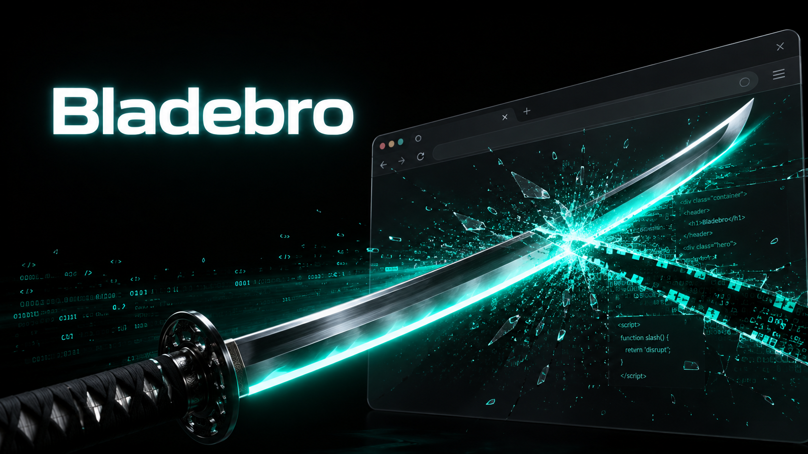
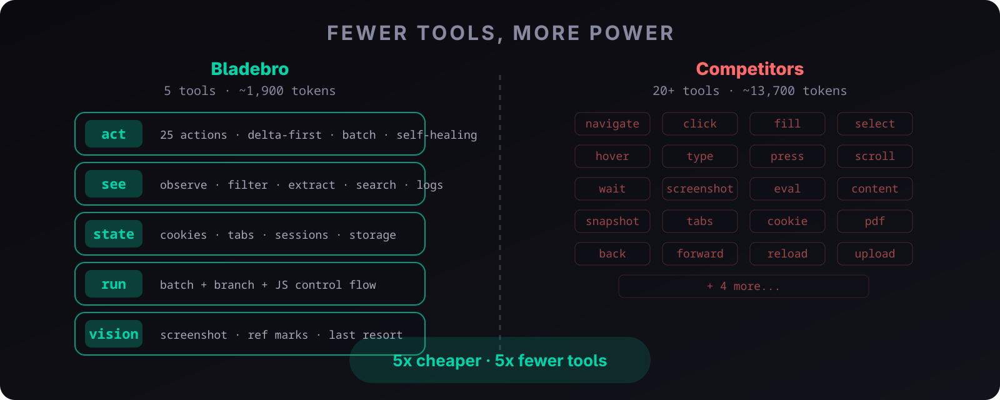
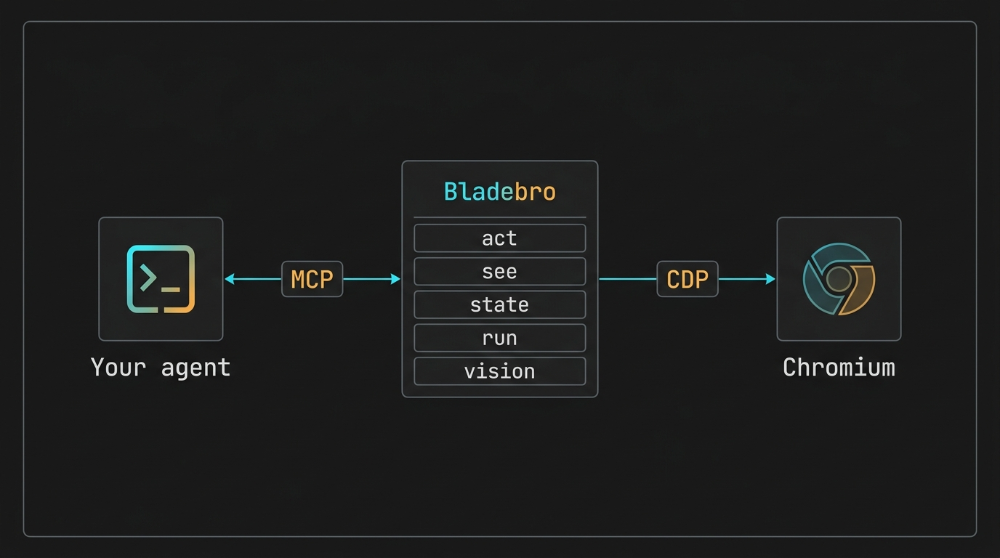
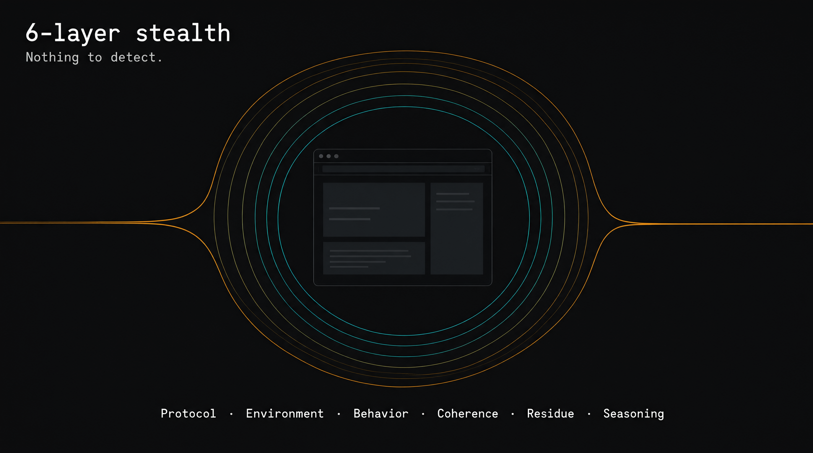
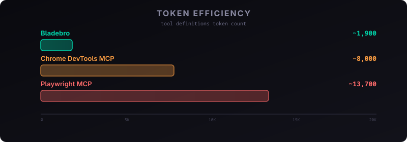

<div align="center">



**Give your AI agent a browser. Few tools. Full control. Real stealth. Zero runtime deps.**

Re-render-immune refs · batch actions · auto-extract · infinite-scroll collect · 6-layer stealth · delta-first

One MCP server · one persistent page model · zero Node.js · one binary · Linux · macOS · Windows

[](https://www.npmjs.com/package/bladebro)
[](https://www.rust-lang.org)
[](LICENSE)
[](https://github.com/dondai44423/bladebro/releases)
[](https://github.com/dondai44423/bladebro/actions/workflows/ci.yml)
[](https://www.npmjs.com/package/bladebro)
[](https://github.com/dondai44423/bladebro)

```bash
npm install -g bladebro && bladebro mcp
```

[Install](#-install) · [The 5 tools](#-the-5-tools) · [Architecture](#-architecture) · [Re-render immunity](#-re-render-immunity) · [Stealth](#-stealth-system) · [Comparison](#-comparison) · [Gotchas](#-gotchas) · [Limits](#-honest-limits)

</div>

---

Bladebro is an **agentic browser driver** built from the agent's perspective. Instead of 20+ tools that each do one thing, Bladebro gives you **5 tools** that together provide full control. It drives stock Chromium over CDP, holds a persistent **Live Page Model** across tool calls, and returns **diff-first** results: the agent sees what *changed*, not the whole world, every single time.

Built in **Rust**. One static binary. No runtime. No Node.js. No Playwright shim. Just the browser engine and your agent. Native on Linux, macOS, and Windows.

Speaks MCP **2024-11-05 through 2026-07-28**: legacy `initialize` handshake and the new stateless per-request negotiation with `server/discover`, dual-dialect. Works with every MCP client, old and new.

### What makes it different

| Innovation | What it means | Status |
|---|---|---|
| **Re-render immunity** | Refs survive React/Vue/Angular DOM replacement via structural fingerprints. No other agent browser does this. | Live-verified |
| **Batch actions** | Multi-step workflows (fill 5 fields, submit, wait) in ONE MCP call instead of 11. | Live-verified |
| **Auto-extract** | Template-free list extraction. No CSS selectors, no setup. Detects structure, scores content, extracts rows. | 10+ sites verified |
| **Infinite-scroll collect** | Scroll + dedupe loop for feeds. ONE call, ONE artifact, zero duplicates. | 80 items verified |
| **6-layer stealth** | Protocol, environment, behavior, coherence, residue, seasoning. All on by default. | incolumitas 8/8 |
| **Delta-first tokens** | Every action returns what changed, not the whole page. 5x cheaper than competitors. | ~1,900-token tool defs |
| **Self-healing refs** | Stale refs re-resolve automatically. Agent never sees "element not found" after navigation. | 26/26 sites |

## 🚀 Install

### npm (recommended)

```bash
npm install -g bladebro
bladebro mcp
```

That's it. No Rust, no compilation, no dependencies. The npm package ships a prebuilt binary for your platform:

| Platform | Package | Size |
|---|---|---|
| Linux x86_64 | `bladebro-linux-x64` | 5.7 MB |
| Windows x86_64 | `bladebro-windows-x64` | 5.2 MB |
| macOS Intel | `bladebro-darwin-x64` | 5.2 MB |
| macOS Apple Silicon | `bladebro-darwin-arm64` | 4.8 MB |

npm resolves the correct binary automatically via `os`/`cpu` fields. Users only download the binary for their platform. Zero postinstall scripts, zero warnings.

### From source

**Prerequisites:** Chromium or Google Chrome (auto-detected), Rust 1.86+. Linux: Xvfb for headless servers (macOS/Windows run headful natively).

```bash
git clone https://github.com/dondai44423/bladebro.git
cd bladebro
cargo build --release
./target/release/bladebro mcp
```

### Connect your AI agent

MCP over stdio — point your agent at the binary:

```json
{ "mcpServers": { "bladebro": { "command": "bladebro", "args": ["mcp"] } } }
```

### Diagnostics

```bash
bladebro -doc    # system check (Chrome, Xvfb, profile, network, version)
bladebro -v      # version + update status
bladebro audit   # stealth verification
```

| Env Var | Default | What it does |
|---|---|---|
| `CHROME_PATH` | auto | Path to Chrome/Chromium binary |
| `BLADE_PROFILE_DIR` | `~/.blade/profile` | Persistent browser profile |
| `BLADE_FRESH` | unset | `1` = ephemeral profile (no persistence) |
| `BLADE_LOCALE` | `en-US` | BCP-47 locale (e.g. `en-GB`, `ne-NP`) |
| `BLADE_TZ` | auto (IP geo) | Timezone (e.g. `Europe/London`, `Asia/Kathmandu`) |
| `BLADE_NOISE` | unset | `1` = enable canvas/audio fingerprint noise |
| `BLADE_WEBGL` | `auto` | `spoof` / `real` / `auto` |
| `BLADE_MEDIA` | `auto` | `patch` / `real` / `auto` |
| `BLADE_PROXY` | none | Proxy URL |

## 🎯 The 5 tools

<div align="center">

</div>

### `act` — act, then observe

Every `act` returns an **outcome verdict + page delta**. Click auto-escalates: mouse, JS, Enter. Click by text (no see needed): `act click text="Sign in"`. Ambiguous text? Error lists matches with refs and nth values: retry `nth=2`.

| Action | Example | What it does |
|---|---|---|
| `click` | `act click e5` or `act click text="Sign in"` | Mouse, JS, Enter escalation |
| `type` | `act type label="Search" text="hello"` | Cadenced typing into textboxes |
| `fill` | `act fill fields=[...] submit="Go"` | Multi-field form fill, auto-detects type |
| `batch` | `act batch steps=[{click},{type},{click}]` | **Multi-step workflows in ONE call** |
| `navigate` | `act navigate url="https://example.com"` | Idempotent, returns full page model |
| `scroll` | `act scroll dy=800` | Smooth eased wheel events |
| `hover` | `act hover text="Products"` | Reveals dropdowns in the delta |
| `collect` | `act collect max=50 timeout=30` | **Auto-extract + scroll + dedupe loop** for infinite feeds |
| `wait` | `act wait condition=url text="dashboard"` | 6 conditions: element, title, settle, url, text, js |
| `eval` | `act eval js="document.title"` | JS eval; `el` in scope when ref given |
| `read` | `act read e5` | Element text content |
| `press` | `act press key=Enter` | Real key event |
| `upload` | `act upload e7 text="/tmp/file.txt"` | File input |
| `select` | `act select e4 option="Nepal"` | Dropdown by text or value |
| `pdf` | `act pdf` | Export page as PDF artifact |
| `download` | `act download url=... timeout=10` | Fetch+Blob download, returns path |
| `back` / `forward` / `reload` | `act back` | History + reload |

**Self-healing refs** — stale refs re-resolve automatically. If e5 was "Sign in" and the page navigated, `act click e5` finds the new "Sign in" and clicks it. You see `[ref e5 healed]` in the verdict.

**Batch actions** — run multi-step workflows in ONE MCP call. Fills, submits, multi-click sequences: one call, one final delta. Halts on navigation or first error with step-level context. 5-step form fill+submit in one call instead of 11.

**`url=` on any action** — `act fill url="https://..." fields=[...]` navigates first, then fills. One call to go to a page AND act on it. Exception: `download` fetches via JS (no navigation), `set-cookie` uses url for cookie scope.

**`slim=true`** — returns verdict only, no delta. Use when you know what happens next.

### `see` — observe (rarely needed)

Navigate and act already return page state. Use `see` for:

| Call | What you get |
|---|---|
| `see` | Full view (semantic folding: nav/footer auto-fold) |
| `see filter="button,link"` | Filtered by role/name/landmark |
| `see find="price"` | Search elements by text, get refs + scores |
| `see extract="auto"` | **Template-free list extraction**: structural detection, content-value scoring |
| `see extract="json" template={...}` | Structured data from listing pages (one call) |
| `see extract="links"` or `"forms"` | All links or all form fields |
| `see logs="console"` | JS errors/warnings, errors first |
| `see logs="network"` | Requests with status, failures first |
| `see content=true` | Page text |
| `see scope=e5` | One element's subtree text |

**Auto-extract (`extract=auto`)** — deterministic structural list extraction. For every element with 3+ children, groups by structural signature, scores by content value (count x text x external links x headings x images). Extracts title, URL, image, price, date, text. Verified on HN (30 articles), Lobste.rs (25 stories), Wikipedia (50 references), DuckDuckGo, StackOverflow, Reddit, GitHub, MDN.

**Collect (`act collect`)** — native scroll+dedupe loop for infinite feeds. Auto-extract, dedupe by URL/title/text, scroll, repeat until max or no new items. ONE call, ONE artifact. Verified: 80 items from infinite-scroll test page, 0 duplicates.

**Big data goes to files.** Extracts over ~6KB are written to `~/.blade/artifacts/` and the response gives you the path + preview. Read the file.

### `state` — cookies, storage, tabs, sessions

| Call | What it does |
|---|---|
| `state op=tabs` | List tabs (* = current) |
| `state op=open-tab url="..."` | Open + auto-focus new tab |
| `state op=switch-tab target_id="..."` | Switch to a tab |
| `state op=close-tab target_id="..."` | Close tab (auto-switches if current) |
| `state op=cookies` | List cookies |
| `state op=set-cookie name=token value=abc` | Set a cookie |
| `state op=save name=login` | Save session (cookies + storage) |
| `state op=load name=login` | Restore session |

### `run` — batch + branch + JS

All act fields work in steps (ref, text, label, nth, js, key, url, etc). Plus `if` and `while` control flow.

```json
{"steps":[
  {"action":"type","label":"Email","text":"user@mail.com"},
  {"action":"type","label":"Password","text":"secret"},
  {"action":"click","text":"Sign in"},
  {"action":"wait","condition":"element","text":"Dashboard","timeout":10}
]}
```

### `vision` — screenshot (last resort)

Returns base64 PNG. `vision marks=true` overlays numbered ref badges on elements so you can say "click e5" after seeing the screenshot. The structural model is almost always better: cheaper, more reliable, gives you refs to act on.

## 🏗️ Architecture

<div align="center">

</div>

The **Live Page Model** is the core innovation. It holds a persistent, compressed, ref-stable model of the page across tool calls. Every `act` returns a **delta** (what changed), not the full page. Refs (`e1`, `e2`, ...) are stable semantic anchors that survive DOM mutations AND re-renders. No more "stale element" failures.

Three pillars:
- **Stable refs** (`e1`, `e2`, ...) — semantic anchors that self-heal across navigations and re-renders
- **Structural fingerprints** (`fp=0xdeadbeef`) — FNV-1a hash of ancestor chain, tag, children, identity attributes
- **Deltas only** (`{ -x, +y }`) — every action returns what changed, not the whole world

## 🧬 Re-render immunity

**The #1 reliability gap in every other agent browser, solved.**

When React, Vue, or Angular re-renders a component, the DOM nodes are destroyed and recreated. Every other agent browser loses all refs — the agent must recapture, re-identify elements, and re-learn the page. Bladebro doesn't.

Every captured element gets a **structural fingerprint** — an FNV-1a hash of its ancestor chain, tag, children, and identity attributes. When a re-render changes text (the sig changes) but preserves structure (the fingerprint is identical), the stabilizer rebinds the ref via fingerprint match instead of invalidating it.

```
Before re-render:  e2 button "Buy Now"     sig=button|Buy Now|1  fp=0xdeadbeef
After re-render:   e2 button "Buy Now v1"  sig=button|Buy Now v1|1  fp=0xdeadbeef  ← SAME fp
                   ↺ e2 (re-render survived)
```

The agent sees `↺ e2 (re-render survived)` in the delta. The ref never died. The click works. No recapture needed.

**Verified live:** SPA-style `innerHTML` replacement (React-equivalent DOM destruction) — ref `e2` tracked from "Buy Now" to "Buy Now v1" via fingerprint, click on surviving ref incremented the counter. Zero refs lost.

**No other agent browser does this.** Playwright, Puppeteer, CDP wrappers, SerpAPI — all lose refs on re-render. Bladebro's structural fingerprint is built on the global per-frame-rank signature scheme, which is the prerequisite none of them have.

## 🛡️ Stealth system

<div align="center">

</div>

Six layers. All on by default. No config needed.

| Layer | What it does |
|---|---|
| **Protocol** | No `Runtime.enable` (defuses DataDome console trap), CDP over pipe (zero listening ports, Unix) |
| **Environment** | UA override (no HeadlessChrome), WebGL renderer, outerWidth/innerWidth, screen geometry, hardwareConcurrency, deviceMemory, permissions, mediaDevices |
| **Behavior** | Bezier mouse paths with overshoot+correction, log-normal typing cadence, idle hum (mouse movement during idle), smooth scroll |
| **Coherence** | Per-domain stealth memory (timezone + locale), geo-consistent identity, WebRTC fail-closed, stable canvas/audio (no noise by default) |
| **Residue** | cdc_ property removal, native toString integrity, MutationObserver for late artifacts |
| **Seasoning** | Persistent browser profile (localStorage survives restarts), storage quota, font audit, window.chrome object |

**Verified against real detection sites:**

| Test | Score |
|---|---|
| 36-vector local suite | 36/36 pass |
| bot.sannysoft.com | ALL PASS |
| incolumitas.com | 8/8 automated tests PASS (webdriver=false, no UA leak, no override/overflow) |
| CreepJS | headless: 33% (one sub-test; core indicators clean) |
| Boot self-check | 4/4 OK |

Run `bladebro audit` to verify your own setup.

## 📊 Comparison

<div align="center">

</div>

| | Bladebro | Playwright MCP | Chrome DevTools MCP |
|---|---|---|---|
| Tool defs | ~1,900 tokens | ~13,700 tokens | ~8,000 tokens |
| Per-click result | 60-570 tokens (delta) | 2,000+ tokens (full page) | 2,000+ tokens |
| Stealth | 6-layer, built-in | None | None |
| Re-render immunity | Yes (structural fingerprints) | No | No |
| Auto-extraction | Template-free (extract=auto) | No | No |
| Infinite scroll collect | Yes (act collect) | No | No |
| Batch actions | Yes (act batch) | No | No |
| Shadow DOM | Pierced (deepAll) | Partial | Partial |
| PDF export | Yes (act pdf) | No | No |
| Download handling | Yes (act download) | No | No |
| Runtime | None (static binary) | Node.js | Node.js |
| Process model | Long-lived daemon (stateful) | Stateless (reconnect per call) | Stateless |
| Page model | Persistent, ref-stable, diff-first | None | None |
| Binary size | 5.7 MB | ~50 MB (node + deps) | ~50 MB (node + deps) |
| Install | `npm install -g bladebro` | npm + playwright install | npm |
| Platforms | Linux, macOS, Windows | Linux, macOS, Windows | Linux, macOS, Windows |

**5x more token-efficient** than every competitor. The Live Page Model is the core innovation: it holds a persistent, compressed, ref-stable model of the page across tool calls. Every `act` returns a **delta** (what changed), not the full page. Refs (`e1`, `e2`, ...) are stable semantic anchors that survive DOM mutations AND re-renders. No more "stale element" failures.

## ⚠️ Gotchas

| Surprise | Why |
|---|---|
| Cloudflare Turnstile blocks Bladebro | Turnstile requires actual challenge solving, not just fingerprint spoofing. You get a `blocked:` verdict, not a hang. |
| Datacenter IPs get flagged | Server/VPS IPs are flagged regardless of browser fingerprint. Use `BLADE_PROXY` with a residential proxy. |
| Cross-origin iframes are invisible | SecurityError on `contentDocument`. Deliberate limitation; would need `Runtime.enable` (breaks stealth). |
| macOS/Windows binaries cross-compiled | Built via cargo-zigbuild (zig linker) from Linux, not native-tested on real macOS/Windows machines. File an issue if something breaks. |
| `BLADE_NOISE=1` can *hurt* stealth | FingerprintJS ML detects noise injection as "browser tampering." Off by default. Only use if you know why. |

## 🧱 Honest limits

| What it can NOT do | Why |
|---|---|
| Solve CAPTCHAs | Deliberate. CAPTCHA solving is a separate problem. You get a `blocked:` verdict and can hand off to a solver. |
| Run browser extensions | CDP does not support extension loading. Would break the stealth profile. |
| Access cross-origin iframe content | SecurityError. Would need `Runtime.enable` which defuses the stealth protocol layer. |
| Record video of the session | CDP does not expose frame buffers. Use screenshots (`vision`) instead. |
| Run on ARM Linux | No cross-compile target for aarch64 Linux yet. x86_64 Linux, x86_64/arm64 macOS, x86_64 Windows are supported. |

## 🔄 Update hub

| Command | What it does |
|---|---|
| `npm update -g bladebro` | Update to latest (npm install) |
| `bladebro -u` | Check for updates, download, install (from-source install) |
| `bladebro -doc` | Diagnose system, suggest fixes |
| `bladebro --rollback` | Restore previous version after broken update |
| `bladebro -v` | Show version + update status |

Set `BLADE_NO_UPDATE_CHECK=1` to skip update checks.

## 🤝 Contributing

PRs welcome. See [CONTRIBUTING.md](CONTRIBUTING.md). Run `cargo clippy --release -- -D warnings` and `cargo test --release` before submitting.

## 📄 License

AGPL-3.0 | see [LICENSE](LICENSE).
